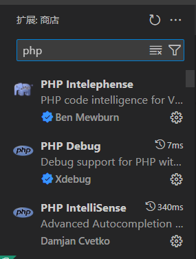

## 关于如何配置vscode debug php和mysql

>摘抄自某人的随笔

**关于配置PHPXdebug的注意事项**

- [这里](https://xdebug.org/download)下载适合你版本的xdebug.dll文件（使用`php -v`来确认你的php版本）
- 需要注意你的php是否为`线程安全版本（-ts-）`
- 确认你的系统在运行哪个php（`php --ini`）
- 把下载到的dll文件放到对应目录下的`ext`文件夹中
- 重启php服务
- `php -m | findstr xdebug`若在控制台输入该指令的输出为`xdebug`，则证明安装有效。

**关于配置php vscode debug的事情**

- 给vscode安装对应的debug插件

  

- 确认你的xdebug确实装好了

- 系统环境变量、插件的路径都要设置对

- `php.ini`里面要配置好这段配置文本

  ```ini
  [Xdebug]
  zend_extension="你的xdebug.dll路径"
  xdebug.mode=debug
  xdebug.start_with_request=yes
  xdebug.client_host=127.0.0.1
  xdebug.client_port=9004			// 记得检查路径是否有冲突！
  xdebug.log="D:\environment\xampp\tmp\xdebug.log"  // 这里是个log文件，一些错误信息并不会输出到控制台，需要在log里确认
  ```

- vscode的`launch.json`里面的**端口号**也需要修改！[xampp+vscode 安装PHP断点调试xdebug - 飞龙在生 - 博客园](https://www.cnblogs.com/flzs/p/17764736.html)

  ```json
  {
    "version": "0.2.0",
    "configurations": [
         
        {
            "name": "Listen for Xdebug",
            "type": "php",
            "request": "launch",
            "port": 9004
        }
    ]
  }
  ```

  

- 调试器端口连上但是路径设置的不对，会出现在代码运行时，断点断不住的情况，需要重新确认路径哪里配错了。


