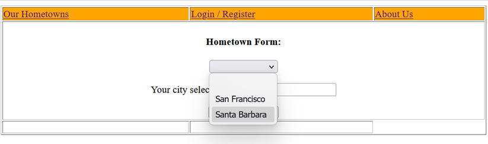
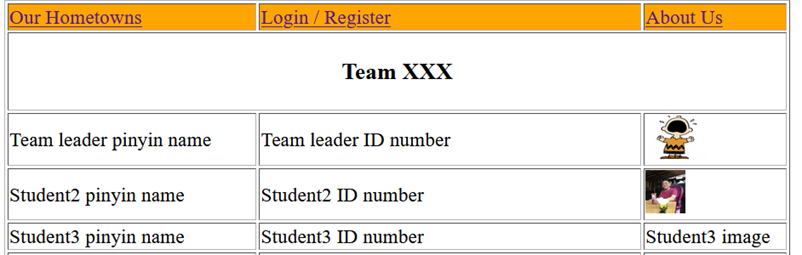

Team Project

SWDW 2025

Reference in the presentation section of iSpace:

OnPresentation.pptx, OnProject.pptx and TopicsCoverage_template.docx

**Overview**

Create a website to promote your hometowns for tourists.

You’ve already did part of the front end in Assignment 1.

Choose at least four hometowns from your team members

In each hometown, introduce the things to do, places to visit, food to eat, etc.

A user can browse the website without logging in.

To make a reservation, the user must login.

In order to log in, the user must register.

**Basic Features**

In **hometowns.html**, a list of your hometowns appears in a drop down list. (I only have 2 cities, but you should have at least 4 cities in your website.)

When a city is selected (San Francisco in this example), a list of that city’s attractions and photo appear, slightly different from Assignment 1.

The **navigation bar** contains the links Our Hometowns (to hometowns.html), Login/Register (to loginRegForm.html) and About Us (to aboutus.html). All three of these html files share the same Navigation Bar, so apply the same CSS file project.css on all three files.

|  | When mouse over one of these links, the font increases in size and changes color (similar to Assignment 1). |
|----|----|

When Login / Register is clicked, **loginRegForm.html** is opened.

In the left form, the user can login by clicking the Login button (which submits the form values to login.php). In the right form, a new user can register by clicking the Register button (which submits the form values to register.php). You need to write the php files.

**Login.php** compares the username and password with the values in the database touristMem.sql. If the username and password matches the database, the username and password are saved as session variables so other php files can use them during the current session. See more explanations in www.w3schools.com/php/php_sessions.asp.

**Register.php** adds a new user into the database. First it checks if the new user name is already in the database. (Note the class exercise code for member registration did not check this.) If the user name is not in the database and the two passwords agree, the new user and password are added into the database.

**AboutUs.html** contains the team name and all the member names, IDs and images.

When the Make Reservation button is clicked in hometowns.html, the form value for the city selected is sent to **reservation.php**. If the user has not logged in yet, a warning is given. If the user has logged in already, the city is updated in the database.

The database touristMem.sql contains the following attributes:

> mid (integer up to 5 digits, primary key),
>
> username (string up to 25 characters),
>
> password (string up to 25 characters),
>
> real_name (string up to 25 characters),
>
> city (string up to 25 characters).

We kept thing simple here. After you take DBMS class next semester, you can work with more realistic data.

**More Features**

After you completed the basic features, make your code to do the following.

\(1\) When registering a new user, have him or her to enter the real name to be added into the DB.

\(2\) Apply automatic input data validation. Make sure the input value is not empty when a value is required, automatically check if the input values are valid, etc.

\(3\) Create new html and php files to allow the user to make searches.

(3a) Show which city a specific user has chosen. Enter the user name, and the code shows the city that person has selected.

(3b) Show which users have selected a specific city. A city is entered, and the code shows all people who selected that city.

\(4\) Implement any good feature we didn’t list, that you think should be added. Limit one new feature per team, and you can only use the tools we’ve taught in this class. If you have more than one, you should implement your best new feature.
