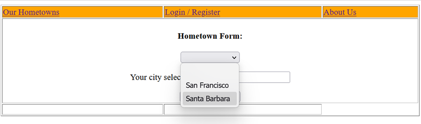
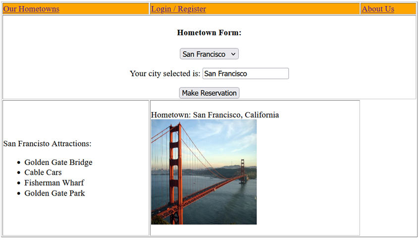
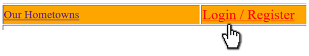
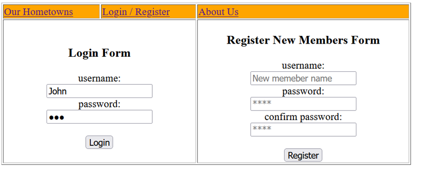
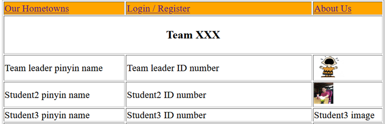

团队项目  

SWDW 2025  

在iSpace演示部分的参考资料：  
OnPresentation.pptx、OnProject.pptx和TopicsCoverage_template.docx  

**项目概述**  
创建一个网站，用于向游客推广你们团队成员的家乡。  

你们已经在作业1中完成了部分前端开发。  

从团队成员中至少选择四个家乡进行介绍。  
每个家乡需介绍可进行的活动、游览的景点、推荐的美食等。  
用户无需登录即可浏览网站。  
如需预订，用户必须登录。  
要登录，用户需先注册。  

**基本功能**  
在**hometowns.html**中，家乡列表以下拉菜单形式显示。（示例中仅有两个城市，但你的网站应至少包含四个城市。）  

  

当选择一个城市（例如旧金山），该城市的景点列表和照片会显示，与作业1略有不同。  

  

**导航栏**包含以下链接：  
- Our Hometowns（跳转至hometowns.html）  
- Login/Register（跳转至loginRegForm.html）  
- About Us（跳转至aboutus.html）  

这三个HTML文件共用相同的导航栏，因此需为它们应用相同的CSS文件project.css。  

|  | 鼠标悬停在这些链接上时，字体大小会增大并变色（类似作业1）。 |  
|----|----|  

点击Login / Register后，会打开**loginRegForm.html**。  

  

左侧表单中，用户可点击Login按钮登录（表单数据将提交至login.php）。右侧表单中，新用户可点击Register按钮注册（表单数据将提交至register.php）。你需要编写这两个PHP文件。  

**Login.php**会将用户名和密码与数据库touristMem.sql中的值进行比对。若匹配，则将用户名和密码保存为会话变量，以便其他PHP文件在当前会话中使用。详见www.w3schools.com/php/php_sessions.asp。  

**Register.php**会将新用户添加到数据库中。首先检查用户名是否已存在（注意课堂练习中的会员注册代码未实现此功能）。若用户名未被占用且两次输入的密码一致，则将新用户信息加入数据库。  

**AboutUs.html**需包含团队名称、成员姓名、学号及照片。  

  

在hometowns.html中点击Make Reservation按钮时，所选城市的数据会提交至**reservation.php**。若用户未登录，系统会发出警告；若已登录，则将该城市信息更新至数据库。  

数据库touristMem.sql包含以下字段：  
> mid（5位整数，主键）  
> username（最长25字符的字符串）  
> password（最长25字符的字符串）  
> real_name（最长25字符的字符串）  
> city（最长25字符的字符串）  

我们在此简化了设计。待下学期学习DBMS课程后，你们可以处理更复杂的数据。  

**扩展功能**  
完成基本功能后，请实现以下内容：  
1. 注册新用户时，要求填写真实姓名并存入数据库。  
2. 应用自动输入验证：确保必填字段非空，并自动检查输入值是否有效等。  
3. 创建新的HTML和PHP文件以支持用户搜索：  
   (3a) 查询特定用户选择的城市：输入用户名，显示其选择的城市。  
   (3b) 查询选择特定城市的用户：输入城市名，显示所有选择该城市的用户。  
4. 实现一项未列出的实用功能（每团队限一项，仅限本课程教授的工具）。若有多个创意，请选择最优方案实现。